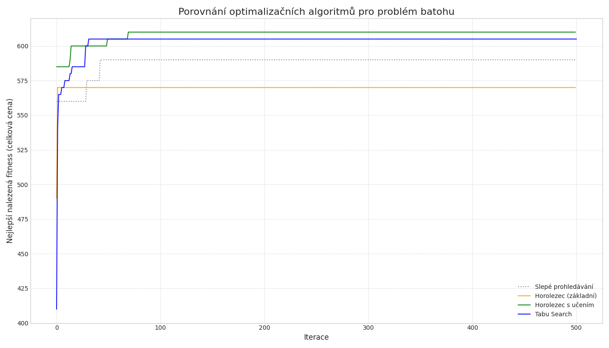
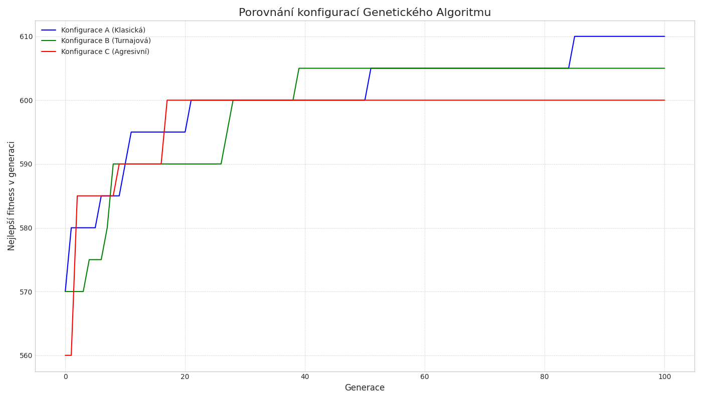
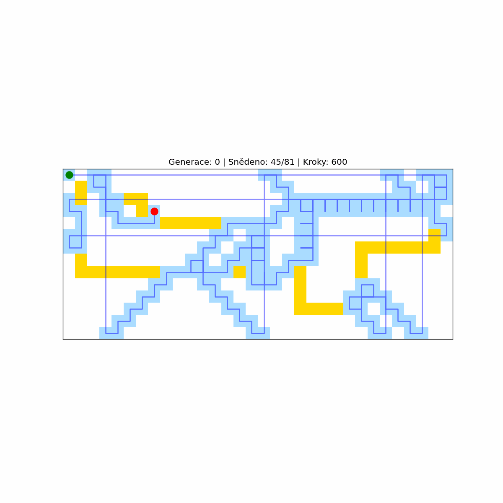
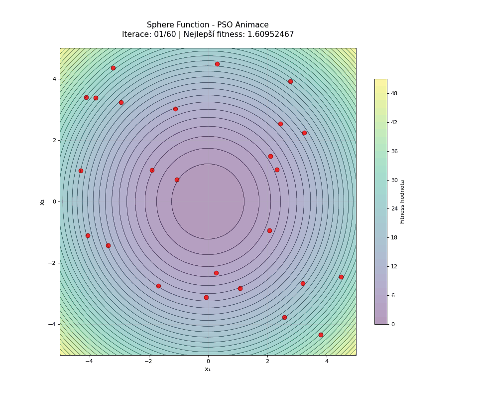
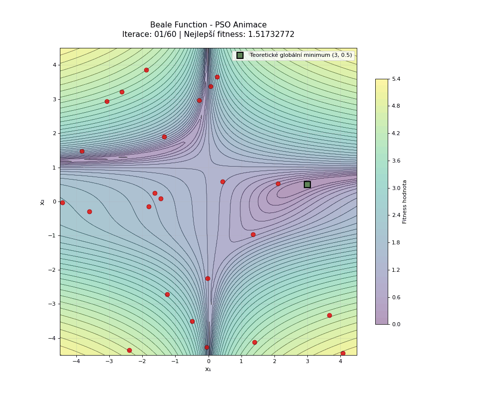

# EMO - Evoluční modelování

Tento repositář obsahuje řešení zadání z kurzu EMO (Evoluční modelování). Každé zadání se zaměřuje na jiný typ optimalizačních algoritmů a jejich aplikace na konkrétní problémy.

## Úkol 1 - Stochastické prohledávání

**Problém:** Knapsack problem (problém batohu)  
**Algoritmy:** Slepé prohledávání (Blind Search) a Horolezec (Hill Climbing)

### Algoritmy:

**Slepé prohledávání (Blind Search):**
- Náhodně generuje řešení bez využití informace o kvalitě předchozích řešení
- Slouží jako baseline pro porovnání s pokročilejšími algoritmy
- Velmi jednoduché, ale neefektivní

**Horolezec (Hill Climbing):**
- Lokální hledání, které se snaží zlepšovat aktuální řešení
- V každém kroku hledá lepší řešení v okolí současného
- Může uvíznout v lokálních optimech

### Výsledky:
- Slepé prohledávání: základní fitness
- Horolezec: výrazně lepší konvergence k lokálnímu optimu

---

## Úkol 2 - Deterministické prohledávání

**Problém:** Knapsack problem (problém batohu)  
**Algoritmy:** Horolezec s učením (Hill Climbing with Learning) a Tabu Search

### Algoritmy:

**Horolezec s učením (HCwL):**
- Rozšíření základního horolezce o pravděpodobnostní učení
- Udržuje pravděpodobnostní vektor pro generování nových řešení
- Učí se z nejlepších nalezených řešení (parametr B_BEST)

**Tabu Search:**
- Pokročilá metoda lokálního hledání s pamětí
- Používá tabu seznam pro vyhnutí se cyklování
- Umožňuje dočasné zhoršení pro únik z lokálních optim

### Výsledky:
- Hill Climbing with Learning: adaptivní zlepšování
- Tabu Search: schopnost úniku z lokálních optim
- Parametry: POP_SIZE=50, B_BEST=5, LEARNING_RATE=0.1, TABU_TENURE=7

---

## Úkol 3 - Evoluční algoritmy

**Problém:** Knapsack problem  
**Nástroj:** PyGAD (Python Genetic Algorithm)  
**Testované konfigurace:** Různé selekční a křížící operátory

### Konfigurace:

**Konfigurace A (Klasická):**
- Selekce: Steady State Selection (SSS)
- Křížení: Single Point Crossover
- Mutace: Random (10% genů)

**Konfigurace B (Turnajová):**
- Selekce: Tournament Selection (K=3)
- Křížení: Two Points Crossover
- Mutace: Random (10% genů)

**Konfigurace C (Agresivní):**
- Selekce: Roulette Wheel Selection (RWS)
- Křížení: Uniform Crossover
- Mutace: Adaptive (0.3 → 0.1)

### Výsledky:
Srovnání konvergence různých konfigurací genetického algoritmu s populací 50 jedinců přes 100 generací.

---

## Úkol 4 - Genetické programování

**Problém:** Santa Fe Ant Trail  
**Nástroj:** DEAP (Distributed Evolutionary Algorithms in Python)  
**Cíl:** Vyvinout program pro mravence, který sebere maximum jídla na Santa Fe trail

### Popis problému:
- Mravenec se pohybuje po 32×14 gridě
- Cílem je sebrat co nejvíce kusů jídla (89 celkem)
- Primitivy: move_forward, turn_left, turn_right, if_food_ahead
- Omezení: maximálně 600 kroků

### Parametry evoluce:
- Populace: 300 jedinců
- Generace: 50
- Crossover: 70%, Mutace: 20%
- Selekce: Tournament (velikost 7)

### Výsledky:
Evoluce úspěšně vytvořila program schopný navigovat po trail a sbírat jídlo.

---

## Úkol 5 - Neuroevoluce

**Problém:** Flappy Bird  
**Nástroj:** NEAT (NeuroEvolution of Augmenting Topologies)  
**Cíl:** Naučit neurální síť hrát Flappy Bird

### Parametry NEAT:
- Populace: variabilní (evolučně se mění)
- Fitness: počet překonaných překážek
- Vstupy: pozice ptáka, pozice a vzdálenost k překážkám
- Výstup: skok/neskok

### Výsledky:
Úspešné natrénování AI, která dokáže hrát Flappy Bird a překonávat překážky.

[Záznam hry](05/recording-20250613-003842.mp4)

---

## Úkol 6 - Přírodou inspirované výpočty

**Algoritmus:** Particle Swarm Optimization (PSO)  
**Testované funkce:** Sphere, Rastrigin, Ackley, Beale  
**Cíl:** Najít globální minima optimalizačních funkcí

### Parametry PSO:
- Počet částic: 30
- Iterace: 100
- Inertia weight (w): 0.7
- Cognitive parameter (c1): 1.5
- Social parameter (c2): 1.5

### Testované funkce:

**Sphere Function:**
- Jednoduchá konvexní funkce
- Globální minimum: f(0,0) = 0

**Rastrigin Function:**
- Multimodální funkce s mnoha lokálními minimy
- Globální minimum: f(0,0) = 0

**Ackley Function:**
- Komplexní multimodální funkce
- Globální minimum: f(0,0) = 0

**Beale Function:**
- Nekonvexní funkce se sedlovými body
- Globální minimum: f(3, 0.5) = 0

### Výsledky a vizualizace:

PSO algoritmus úspěšně našel globální optima pro všechny testované funkce s vysokou přesností.

---

## Závěr

Tento projekt demonstruje široké spektrum optimalizačních algoritmů - od jednoduchých stochastických metod až po pokročilé evoluční algoritmy a neuroevoluci. Každý algoritmus má své specifické výhody a je vhodný pro různé typy problémů.

## Struktura repositáře

- `01-02/` - Stochastické a deterministické prohledávání
- `03/` - Genetické algoritmy (PyGAD)
- `04/` - Genetické programování (Santa Fe Ant)
- `05/` - Neuroevoluce (Flappy Bird)
- `06/` - PSO optimalizace funkcí
